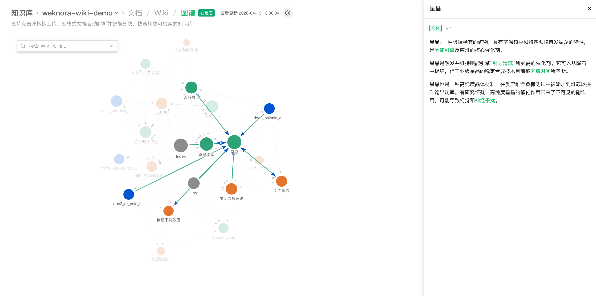
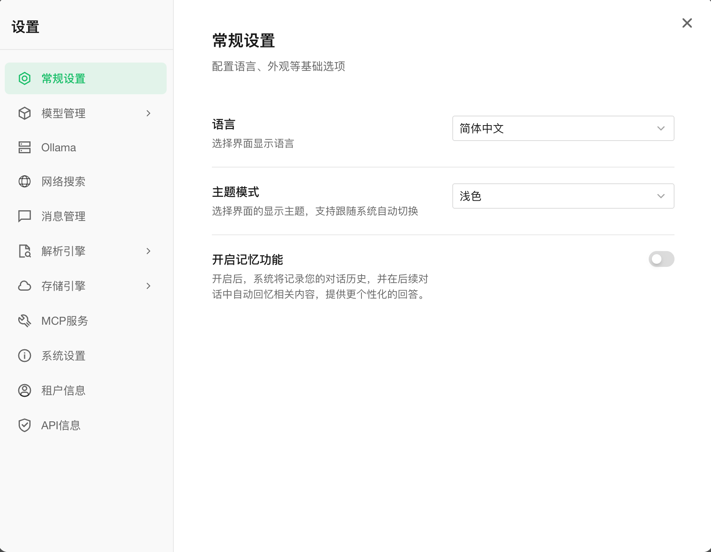

<p align="center">
  <picture>
    
  </picture>
</p>

<p align="center">
    <a href="https://github.com/tohnee/xinwiki-new" target="_blank">
        
    </a>
    <a href="./LICENSE">
        
    </a>
    <a href="./CHANGELOG.md">
        
    </a>
</p>

<p align="center">
| <b>English</b> | <a href="./README_CN.md"><b>简体中文</b></a> |
</p>

<p align="center">
  <h4 align="center">

  [Overview](#-overview) • [Architecture](#-architecture) • [Key Features](#-key-features) • [Getting Started](#-getting-started) • [Deployment Guide](#-deployment-guide) • [Developer Guide](#-developer-guide)

  </h4>
</p>

# 💡 XinWiki — Agent-Powered Knowledge Work Platform

## 📌 Overview

**XinWiki** is an open-source, LLM-powered enterprise knowledge management and intelligent Q&A platform featuring an Apple-inspired bright tech design and NotebookLM-style interaction, built for team knowledge consolidation and efficient collaboration.

The platform is built around three core capabilities: a **Hybrid Retrieval Engine** (BM25 + vector retrieval + knowledge graph) for high-precision Q&A, a **ReAct Agent** that autonomously orchestrates knowledge retrieval, MCP tools, and web search for complex multi-step tasks, and a brand-new **Wiki Mode** where agents automatically generate structured, interlinked knowledge bases and visual knowledge graphs from raw documents. Combined with a three-column Workspace layout, thinking chain visualization, integration with 20+ major LLM providers, enterprise-grade multi-tenant RBAC (with UUM authentication integration), and a fully modular architecture for private deployment, XinWiki helps teams turn scattered documents into queryable, reasoning-capable, continuously evolving knowledge assets.

XinWiki supports automatic knowledge sync from Feishu, Notion, and Yuque, covers 10+ document formats including PDF, Word, images, and Excel, and is compatible with major LLM providers including OpenAI, Anthropic Claude, DeepSeek, Qwen, Zhipu, Doubao, Gemini, and Ollama. The fully modular design allows flexible swapping of LLMs, vector databases, and storage backends, with support for local and private cloud deployment ensuring complete data sovereignty.

## ✨ Key Features

### 🤖 Intelligent Conversation & Reasoning
- **Thinking Chain Visualization**: Complete display of Agent thought process, tool calls, and Token consumption statistics
- **Hybrid Retrieval Engine**: BM25 sparse recall + Dense dense recall + GraphRAG enhancement with HNSW vector acceleration
- **ReAct Agents**: Progressive multi-step reasoning with custom Agent skills and sandboxed execution
- **Wiki Mode**: Agent-driven automatic generation of structured, interlinked Markdown Wiki pages
- **Model Routing**: Dynamic optimal model selection based on cost/latency with Prompt version management
- **Contradiction Detection**: Automatically identifies and marks contradictory information in documents
- **Observability**: Full-chain tracing with real-time Token usage, cost, and latency statistics

### 📚 Knowledge Management
- **Multiple Knowledge Base Types**: Support for FAQ/Document/Wiki types with folder import, URL import, and tag management
- **High-Performance Compilation**: Incremental compilation engine with millisecond-level knowledge base updates
- **Multi-Source Sync**: Automatic sync from Feishu/Notion/Yuque with incremental and full sync support
- **Multi-Format Support**: PDF/Word/Txt/Markdown/HTML/Images/CSV/Excel/PPT/JSON
- **Semantic Cache**: 0.95 similarity threshold with strict per-tenant isolation, automatically degrades to in-memory storage when Redis is unavailable
- **Embedding Batching**: Dual-trigger mechanism (time window + batch size), per-model independent queues with automatic deduplication

### 🔐 Enterprise Security & Permissions
- **Multi-Tenant RBAC**: Four-tier role matrix (Owner/Admin/Contributor/Viewer) with resource-level permission control
- **UUM Authentication Integration**: Support for enterprise unified user management with organizational structure and department permission inheritance
- **Data Security**: AES-256-GCM encryption at rest, gRPC TLS communication, SSRF protection, Agent sandbox isolation
- **Audit Logs**: Full tenant operation audit trails

### 🎨 Modern Interface
- **Three-Column Workspace**: NotebookLM-inspired design with left navigation, center conversation, right generation panel
- **Apple Bright Tech Style**: Blue theme (#007AFF), glassmorphism effects, smooth animations
- **Responsive Design**: Perfectly adapts to desktop and mobile
- **Dark/Light Mode**: Automatically follows system theme

## 📱 Interface Showcase

<table>
  <tr>
    <td colspan="2" align="center"><b>💬 Three-Column Workspace</b><br/></td>
  </tr>
  <tr>
    <td width="50%" align="center"><b>🧠 Thinking Chain Visualization</b><br/></td>
    <td width="50%" align="center"><b>🕸️ Wiki Knowledge Graph</b><br/></td>
  </tr>
  <tr>
    <td width="50%" align="center"><b>📊 Cost & Usage Dashboard</b><br/></td>
    <td width="50%" align="center"><b>⚙️ System Settings</b><br/></td>
  </tr>
</table>

## 🏗️ Architecture

```
┌─────────────────────────────────────────────────────────────────┐
│                        Frontend (Vue 3 + TDesign)               │
│  ┌─────────────┐  ┌─────────────┐  ┌─────────────────────────┐  │
│  │  Left Nav   │  │  Chat Area  │  │  Right Panel (Wiki/PPT) │  │
│  └─────────────┘  └─────────────┘  └─────────────────────────┘  │
└──────────────────────────────────┬──────────────────────────────┘
                                   │ HTTP/WebSocket
┌──────────────────────────────────▼──────────────────────────────┐
│                         Backend (Go + Gin)                      │
│  ┌──────────┐  ┌──────────┐  ┌──────────┐  ┌──────────────────┐ │
│  │  Router  │  │  Handler │  │ Service  │  │  Agent Engine    │ │
│  └──────────┘  └──────────┘  └──────────┘  │  ┌────────────┐  │ │
│                                              │  │ Think/Act  │  │ │
│  ┌──────────────────────────────────────┐    │  └────────────┘  │ │
│  │  RBAC + UUM Auth + Multi-Tenant      │    └──────────────────┘ │
│  └──────────────────────────────────────┘                         │
│  ┌──────────┐  ┌──────────┐  ┌──────────┐  ┌──────────────────┐ │
│  │ Semantic │  │ Embedding│  │  Model   │  │ Cost Tracking    │ │
│  │  Cache   │  │ Batcher  │  │ Router   │  │ + Aggregation    │ │
│  └──────────┘  └──────────┘  └──────────┘  └──────────────────┘ │
└─────────────┬──────────────────┬──────────────────┬──────────────┘
              │                  │                  │
┌─────────────▼──────┐  ┌────────▼────────┐  ┌──────▼──────────────┐
│  Vector Stores     │  │  LLM Providers  │  │  Document Parser    │
│  (pgvector/ES/     │  │  (OpenAI/Claude/│  │  (PaddleOCR-VL/     │
│   Milvus/Qdrant)   │  │   DeepSeek/...) │  │   OpenDataLoader)   │
└────────────────────┘  └─────────────────┘  └─────────────────────┘
              │                  │                  │
┌─────────────▼──────────────────▼──────────────────▼──────────────┐
│                    Infrastructure Services                       │
│  ┌────────┐  ┌─────────┐  ┌───────┐  ┌────────┐  ┌────────────┐ │
│  │  Redis │  │PostgreSQL│ │ MinIO │  │ Neo4j  │  │  Langfuse  │ │
│  └────────┘  └─────────┘  └───────┘  └────────┘  └────────────┘ │
└─────────────────────────────────────────────────────────────────┘
```

## 🧩 Tech Stack

| Layer | Technologies |
|-------|--------------|
| **Frontend** | Vue 3 + TypeScript + Vite + TDesign + Pinia |
| **Backend** | Go 1.24+ + Gin + GORM + Wire (DI) |
| **Document Parser** | Python + PaddleOCR-VL + OpenDataLoader |
| **Vector Databases** | PostgreSQL (pgvector) / Elasticsearch / OpenSearch / Milvus / Qdrant |
| **Relational DB** | PostgreSQL 15+ |
| **Cache** | Redis 7+ (semantic cache, session storage) |
| **Object Storage** | MinIO / S3 / Alibaba Cloud OSS / Tencent Cloud COS / Volcengine TOS |
| **Knowledge Graph** | Neo4j (optional) |
| **Observability** | Langfuse + Prometheus |
| **Deployment** | Docker Compose / Kubernetes (Helm) |

## 🚀 Getting Started

### 🛠 Prerequisites

- Docker 24.0+ & Docker Compose v2+
- Git
- At least 4 CPU cores and 8GB RAM (8 cores/16GB recommended for best experience)

### 📦 One-Click Start (Docker Compose)

```bash
# 1. Clone the repository
git clone https://github.com/tohnee/xinwiki-new.git
cd xinwiki-new

# 2. Copy environment configuration
cp .env.example .env

# 3. Edit .env file, configure necessary parameters (at least one LLM API Key)
# vim .env

# 4. Start core services
docker compose up -d
```

Once started, visit **http://localhost** to get started. Default admin credentials: `admin@xinwiki.com` / `admin123`.

> First startup will automatically initialize the database and create default tenant and admin account. Please change the default password immediately.

### 🔧 Optional Services (Docker Compose Profiles)

Add `--profile` flags to enable additional components. Multiple profiles can be combined:

| Profile | Description | Command |
|---------|-------------|---------|
| _(default)_ | Core services (Web+App+PostgreSQL+Redis) | `docker compose up -d` |
| `full` | All features (all optional components) | `docker compose --profile full up -d` |
| `neo4j` | Knowledge Graph (Neo4j) | `docker compose --profile neo4j up -d` |
| `minio` | Object Storage (MinIO) | `docker compose --profile minio up -d` |
| `langfuse` | Tracing (Langfuse) | `docker compose --profile langfuse up -d` |

Combine profiles: `docker compose --profile neo4j --profile minio up -d`

Stop services: `docker compose down`

Stop services and remove data: `docker compose down -v` ⚠️ This deletes all data

### 🌐 Service URLs

| Service | URL | Default Credentials/Notes |
|---------|-----|---------------------------|
| XinWiki Web UI | http://localhost | admin@xinwiki.com / admin123 |
| Backend API | http://localhost:8080 | API docs: /swagger/index.html |
| MinIO Console | http://localhost:9001 | minioadmin / minioadmin |
| Langfuse Tracing | http://localhost:3000 | See .env configuration |
| Neo4j Browser | http://localhost:7474 | neo4j / neo4jpassword |
| pgAdmin | http://localhost:5050 | pgadmin@xinwiki.com / pgadmin123 |

## 📖 Deployment Documentation

### Local Development Deployment

Please refer to the [Development Setup Guide](./docs/开发指南.md) for local development environment configuration.

### Production Deployment

For detailed production deployment instructions, please refer to the [XinWiki Production Deployment Guide](./docs/DEPLOYMENT.md), which covers:
- Server configuration recommendations
- Detailed environment variable descriptions
- HTTPS configuration
- Data backup and recovery
- Performance tuning
- Monitoring and alerting configuration

## 🧭 Developer Guide

### ⚡ Fast Development Mode

If you need to modify code frequently, use fast development mode without rebuilding Docker images every time:

```bash
# 1. Start infrastructure services (PostgreSQL, Redis, etc.)
make dev-start

# 2. Start backend service (new terminal window)
make dev-app

# 3. Start frontend dev server (new terminal window)
make dev-frontend
```

Development server URLs:
- Frontend: http://localhost:5174
- Backend API: http://localhost:8080

**Development Advantages:**
- ✅ Frontend modifications auto hot-reload (Vite HMR, no refresh needed)
- ✅ Backend modifications support Air hot-reload (second-level restart)
- ✅ No need to rebuild Docker images
- ✅ IDE breakpoint debugging support

### 📋 Make Commands

| Command | Description |
|---------|-------------|
| `make build` | Compile backend binary |
| `make build-frontend` | Build frontend production package |
| `make dev-start` | Start development infrastructure dependencies |
| `make dev-app` | Start backend dev service (Air hot-reload) |
| `make dev-frontend` | Start frontend dev server |
| `make docker-build` | Build Docker images |
| `make test` | Run all unit tests |
| `make lint` | Run code checks |
| `make clean` | Clean build artifacts |

## 📁 Project Structure

```
xinwiki-new/
├── cmd/                    # Entry points
│   └── server/            # Backend service entry
├── internal/              # Internal business code
│   ├── agent/            # Agent engine (think/act/tool calls)
│   ├── acl/              # ACL permission pure functions
│   ├── application/      # Application service layer
│   ├── auth/             # Authentication & RBAC (with UUM integration)
│   ├── config/           # Configuration management
│   ├── container/        # Dependency injection container
│   ├── handler/          # HTTP handlers
│   ├── infrastructure/   # Infrastructure (document parsing, vector stores, etc.)
│   ├── models/           # LLM integrations (Chat/Embedding/Rerank/VLM)
│   ├── router/           # Route configuration
│   ├── types/            # Core type definitions
│   └── wiki/             # Wiki engine (retrieval/compiler/QA)
├── frontend/             # Frontend Vue project
│   ├── src/
│   │   ├── components/  # Components
│   │   ├── views/       # Pages
│   │   ├── stores/      # Pinia state management
│   │   └── api/         # API call wrappers
├── docreader/           # Python document parsing service
├── mcp-server/          # MCP server
├── deploy/              # Deployment configuration files
├── docs/                # Documentation
├── docker-compose.yml   # Docker Compose orchestration
├── Makefile            # Build scripts
└── .env.example        # Environment variable example
```

## 🤝 Contributing

Welcome to submit Issues or Pull Requests.

**Process:** Fork → Create branch → Commit changes → Open PR

**Standards:**
- Backend code formatted with `gofmt`
- Frontend code formatted with ESLint + Prettier
- Follow [Conventional Commits](https://www.conventionalcommits.org/) (`feat:` / `fix:` / `docs:` / `test:` / `refactor:`)

## 🔒 Security Notice

For production deployments, we strongly recommend:

- Deploy XinWiki in internal/private network environments, avoid direct public internet exposure
- Configure firewall rules and access controls to allow only trusted IPs
- Change default admin password immediately
- Configure HTTPS for encrypted transmission
- Regular database backups
- Update to latest version regularly for security patches

## 📄 License

This project is licensed under the [MIT License](./LICENSE).
You are free to use, modify, and distribute the code with proper attribution.
